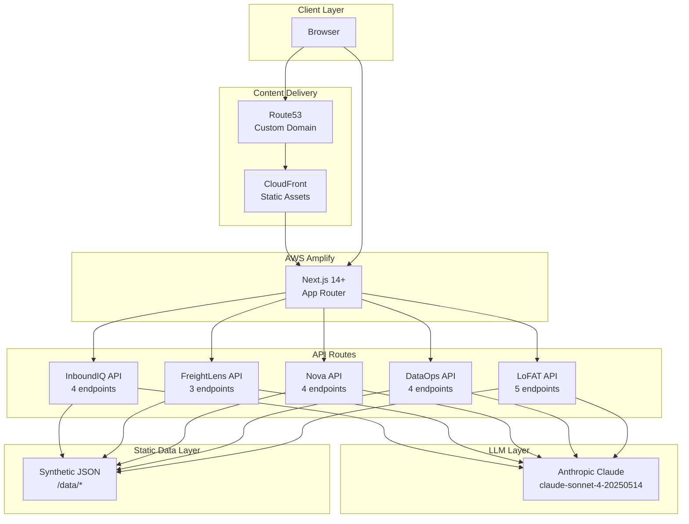
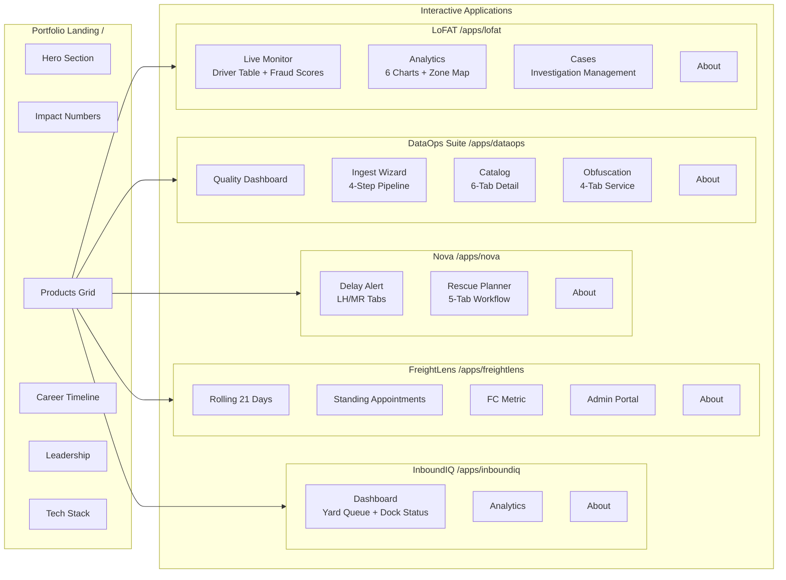
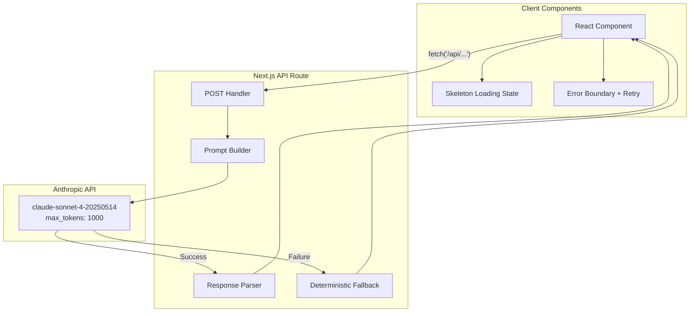
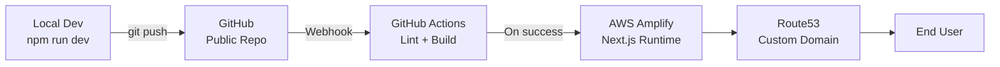

# Portfolio Architecture — System Design Overview

## Overview

This engineering portfolio is a production-grade Next.js application that showcases five real-world systems built over 11+ years at Amazon. Each application is a fully interactive demo with synthetic data, real UI patterns, and LLM-powered features using the Anthropic Claude API.

---

## High-Level Architecture



---

## Application Map



---

## LLM Integration Architecture



### LLM Endpoints by Application

| Application | Endpoint | Purpose | max_tokens |
|-------------|----------|---------|------------|
| **InboundIQ** | `/api/inboundiq/explain-rank` | Explain truck ranking | 1000 |
| | `/api/inboundiq/nl-filter` | Natural language yard filter | 1000 |
| | `/api/inboundiq/dock-intelligence` | Dock allocation recommendations | 1000 |
| | `/api/inboundiq/chat` | Conversational yard assistant | 1000 |
| **FreightLens** | `/api/freightlens/risk-analysis` | Scheduling risk analysis | 1000 |
| | `/api/freightlens/nl-query` | Natural language metric query | 1000 |
| | `/api/freightlens/forecast-summary` | Capacity forecast | 1000 |
| **Nova** | `/api/nova/delay-brief` | Delay intelligence brief | 1000 |
| | `/api/nova/rescue-recommend` | Rescue recommendation | 1000 |
| | `/api/nova/nl-filter` | Natural language delay filter | 1000 |
| | `/api/nova/exec-summary` | Executive summary | 1000 |
| **DataOps** | `/api/dataops/quality-check` | Data quality scoring | 1000 |
| | `/api/dataops/generate-metadata` | Metadata generation | 8000 |
| | `/api/dataops/catalog-chat` | Catalog conversational search | 1000 |
| | `/api/dataops/suggest-obfuscation` | PII obfuscation rules | 1000 |
| **LoFAT** | `/api/lofat/investigate` | Fraud investigation summary | 1000 |
| | `/api/lofat/explain-signal` | Signal explanation | 1000 |
| | `/api/lofat/nl-search` | Natural language driver search | 1000 |
| | `/api/lofat/daily-brief` | Daily intelligence brief | 1000 |
| | `/api/lofat/case-narrative` | Case report generator | 1000 |

---

## Route Architecture

```
/ ................................ Landing page (no sidebar)
├── (landing)/
│   ├── layout.tsx ............... Custom layout, no Fuse sidebar
│   ├── page.tsx ................. Entry point
│   └── LandingPage.tsx ......... 7-section orchestrator
│
├── (control-panel)/
│   ├── layout.tsx ............... Fuse sidebar layout
│   └── apps/
│       ├── inboundiq/ ........... Dock door allocation
│       ├── freightlens/ ......... Freight scheduling
│       ├── nova/ ................ Delay alerts + rescue
│       ├── dataops/ ............. LLM data platform
│       └── lofat/ ............... Fraud detection
│
└── (public)/
    └── sign-in/ ................. Auth pages (unused in portfolio)
```

---

## Data Architecture

All data is synthetic JSON stored in `/data/` with symlinks from `src/data/` for Next.js imports.

```
data/
├── inboundiq/
│   └── trucks.json .............. 150 trucks across 5 FCs
├── freightlens/
│   ├── rolling21.json ........... 21-day capacity grid
│   ├── standing.json ............ Standing appointments
│   ├── metrics.json ............. FC performance metrics
│   └── appointments.json ........ Appointment records
├── nova/
│   ├── delay-alerts.json ........ 150 vehicle delay records
│   └── rescues.json ............. 50 rescue records
├── dataops/
│   ├── catalog.json ............. 12 dataset catalog entries
│   ├── datasets/ ................ 12 × 500-row datasets
│   └── obfuscation-jobs.json .... 200 obfuscation job records
└── lofat/
    ├── drivers.json ............. 200 driver records
    ├── deliveries.json .......... 1000 delivery records
    ├── gpsTraces.json ........... GPS traces for 20 flagged drivers
    ├── cases.json ............... 30 investigation cases
    └── shiftMetrics.json ........ 90-day rolling aggregates
```

---

## Tech Stack

| Layer | Technology |
|-------|-----------|
| Framework | Next.js 14+ App Router |
| Language | TypeScript (strict mode) |
| UI Template | Fuse React (Envato) |
| Styling | Tailwind CSS + MUI |
| Charts | Recharts |
| Maps | React Leaflet |
| Architecture Diagrams | React Flow (@xyflow/react) |
| Animations | motion/react (Framer Motion) |
| LLM | Anthropic Claude API |
| Hosting | AWS Amplify |
| Domain | Route53 |
| CI/CD | GitHub Actions → Amplify |
| Data | Synthetic JSON (no database) |

---

## Deployment Pipeline



Environment variables:
- `ANTHROPIC_API_KEY` — Set in Amplify console, never in code
- All other configuration is static (synthetic JSON data, no database connections)
