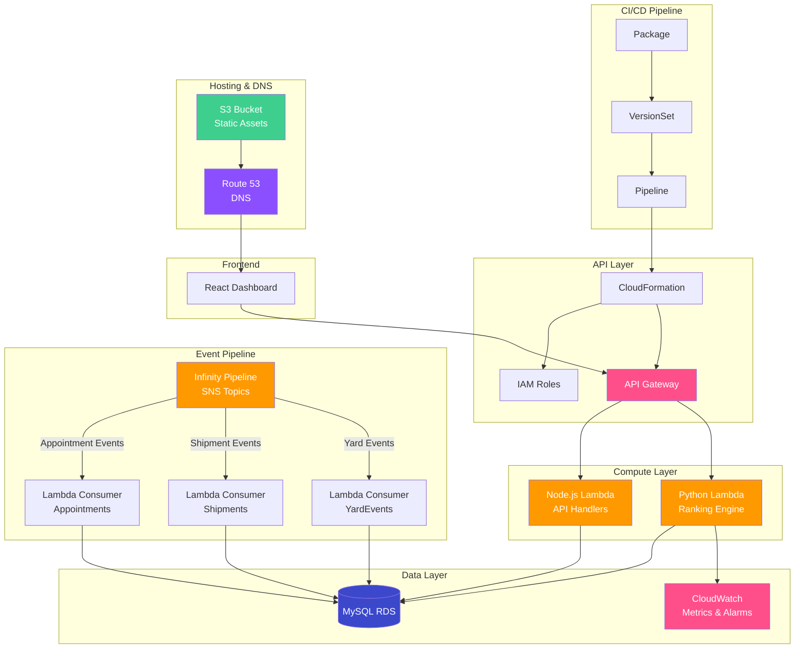

# InboundIQ (Heimdall) — Architecture Document

## System Architecture

### Overview

InboundIQ follows a serverless, event-driven architecture on AWS. The system ingests real-time appointment, shipment, and yard events through the Infinity Pipeline (SNS), processes them via Lambda functions, persists state in MySQL RDS, and serves a React dashboard through API Gateway.

---

## Architecture Diagram



---

## Component Details

### 1. CI/CD Pipeline

| Component | Purpose |
|-----------|---------|
| **Package** | Bundles Lambda code + CloudFormation templates |
| **VersionSet** | Version management across microservices |
| **Pipeline** | Automated deployment to dev/gamma/prod stages |

### 2. API Layer

| Component | Purpose |
|-----------|---------|
| **API Gateway** | REST API endpoints with request validation and throttling |
| **CloudFormation** | Infrastructure-as-code for all AWS resources |
| **IAM** | Fine-grained role-based access for Lambda execution |

**Key Endpoints:**
| Method | Path | Description |
|--------|------|-------------|
| GET | `/api/v1/inboundiq/getFcYardData` | Retrieve ranked yard queue + dock status for an FC |
| POST | `/api/v1/inboundiq/updateCloseAppt` | Close an appointment (mark truck as departed) |
| GET | `/api/v1/inboundiq/getFcDoorStatus` | Get current dock door occupancy |
| POST | `/api/v1/inboundiq/assignDoor` | Assign a yard truck to an available door |

### 3. Compute Layer

| Component | Runtime | Purpose |
|-----------|---------|---------|
| **Node.js Lambda** | Node.js 18.x | API request handlers, CRUD operations |
| **Python Lambda** | Python 3.9 | Ranking engine, scoring model, analytics |

### 4. Data Layer

| Component | Purpose |
|-----------|---------|
| **MySQL RDS** | Primary datastore — Appointments, YardEvents, Shipments |
| **CloudWatch** | Operational metrics, alarms, and dashboards |

**RDS Configuration:**
- Instance: db.r5.large (Multi-AZ)
- Storage: 100 GB gp3 with auto-scaling
- Backup: Automated daily snapshots, 7-day retention
- Encryption: AES-256 at rest, TLS in transit

### 5. Event Pipeline (Infinity Pipeline)

The Infinity Pipeline is Amazon's internal event bus built on SNS. Three event types flow into the system:

| Event Type | SNS Topic | Consumer Lambda | Description |
|-----------|-----------|-----------------|-------------|
| Appointment | `inbound-appointments` | `inboundiq-appt-consumer` | New/updated appointments from WMS |
| Shipment | `inbound-shipments` | `inboundiq-ship-consumer` | Shipment status changes |
| Yard | `inbound-yard-events` | `inboundiq-yard-consumer` | Pre-checkin, check-in, check-out events |

**Event Processing:**
1. SNS delivers event to SQS queue (dead-letter queue configured)
2. Lambda consumer processes the event
3. Upsert into MySQL RDS with optimistic locking (recordVersion)
4. CloudWatch custom metric emitted for event processing latency

### 6. Frontend

| Component | Purpose |
|-----------|---------|
| **React Dashboard** | Real-time yard queue, dock status, analytics |
| **S3** | Static asset hosting |
| **Route 53** | DNS routing to S3/CloudFront |

---

## Data Flow

```
Appointment Created/Updated (WMS)
    │
    ▼
SNS: inbound-appointments
    │
    ▼
Lambda: inboundiq-appt-consumer
    │
    ├──▶ MySQL RDS: UPSERT into Appointments table
    │
    └──▶ CloudWatch: Emit processing_latency metric
```

```
Truck Arrives at FC Gate (YMS)
    │
    ▼
SNS: inbound-yard-events (type: PRE_CHECKIN)
    │
    ▼
Lambda: inboundiq-yard-consumer
    │
    ├──▶ MySQL RDS: INSERT into YardEvents table
    │
    └──▶ Trigger: Re-rank yard queue for this FC
```

```
Dashboard Request
    │
    ▼
API Gateway: GET /getFcYardData?fcId=SEA1
    │
    ▼
Lambda: inboundiq-api-handler
    │
    ├──▶ MySQL RDS: JOIN Appointments + YardEvents
    │
    ├──▶ Python Lambda: Apply ranking model
    │
    └──▶ Return: Ranked yard queue + door status JSON
```

---

## Security

- **Authentication:** Midway Auth (Amazon internal SSO)
- **Authorization:** IAM roles scoped to specific Lambda functions and RDS access
- **Data Encryption:** AES-256 at rest (RDS, S3), TLS 1.2+ in transit
- **API Throttling:** API Gateway rate limiting (1000 req/s per FC)
- **Audit:** CloudTrail logging for all API calls

---

## Scalability

- Lambda auto-scales with request volume (no server provisioning)
- RDS read replicas can be added for read-heavy dashboard traffic
- SNS → SQS buffering absorbs event spikes during peak receiving hours
- API Gateway caching (60s TTL) for frequently requested FC data
