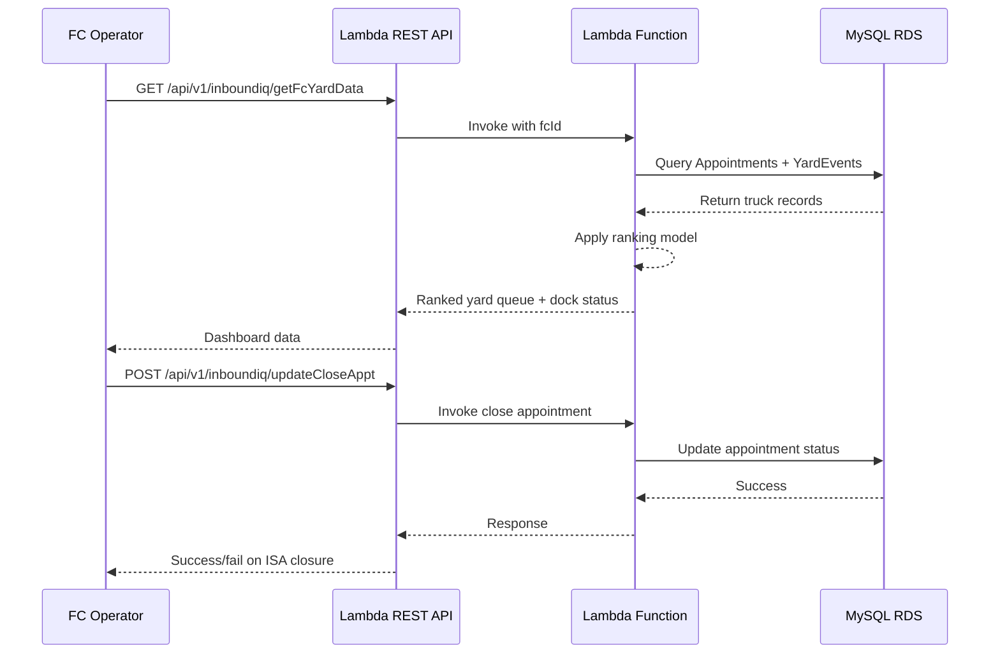

# InboundIQ (Heimdall) — System Design Document

## Overview

InboundIQ is an intelligent dock door allocation engine deployed across Amazon Fulfillment Centers. The system replaces manual truck prioritization with a data-driven scoring model that continuously ranks every truck in the yard, ensuring the most business-critical cargo is unloaded first.

**Key Achievement:** Reduced truck turnaround time (TAT) from 6.7 hours to 2.2 hours (P95).

---

## Problem Statement

Fulfillment Center dock doors are among the scarcest resources in Amazon's inbound logistics network — each site operates with just 10 to 15 doors. Without a systematic prioritization engine, operations associates relied on manual judgment to decide which truck in the yard should be sent to the next available door.

This approach introduced:
- Inconsistency in decision-making across shifts and operators
- Bias toward familiar carriers or recent arrivals
- Frequent misallocation that left high-priority cargo waiting while less urgent loads occupied doors
- Unpredictable turnaround times, impacting downstream stow and pick operations

---

## Tool Tenets

1. **Data over intuition** — Every prioritization decision is driven by quantifiable signals, not operator preference.
2. **Shelf criticality first** — Cargo that addresses out-of-stock SKUs at the FC always takes precedence.
3. **Minimize dwell, maximize throughput** — The system optimizes for fleet-level turnaround, not individual truck convenience.
4. **Transparent and auditable** — Every ranking decision can be explained and traced to specific data inputs.

---

## System Constraints

- Each FC has 10–15 dock doors (scarce resource)
- Trucks arrive in three states: Scheduled (en route), PreCheckin/Arrived (in yard), CheckedIn (at dock)
- Only yard trucks (PreCheckin/Arrived) are ranked — scheduled trucks have no yard data
- Ranking must refresh within 2 minutes of any state change
- System must support 5 FCs concurrently: SEA1, PDX2, LAX3, ORD2, JFK4
- All appointment, yard event, and shipment data flows through the Infinity Pipeline (SNS)

---

## Definitions

| Term | Definition |
|------|-----------|
| **YMS Pre-checkin** | Driver registers arrival at the FC gate. Truck enters the yard queue and begins accumulating dwell time. |
| **YMS Check-in** | Truck is assigned a dock door and moves from the yard to the loading bay. Unloading begins. |
| **Dockmaster Check-in** | Operations associate physically confirms the truck is positioned at the assigned door and clears it for unloading. |
| **YMS Check-out** | Unloading is complete. The door is released back to the available pool and the truck exits the facility. |
| **ISA/VRID** | Internal Shipment Authorization / Vehicle Registration ID — the primary identifier linking a truck to its shipment. |
| **Low In-Stock %** | Percentage of SKUs in the incoming cargo that are currently out of stock at the destination FC (0–80%). Higher = more urgent. |
| **Stow Time Remaining** | Time left in the stow window before cargo becomes backlogged. |

---

## Priority Buckets (Ranked)

The ranking model assigns a composite priority score to each yard truck. Trucks are ordered by descending score within each FC.

### Priority Score Formula

```
Priority = (lowInstockPct × 0.35)
         + (apptTypeScore × 0.25)
         + (dwellHoursScore × 0.20)
         + (stowUrgencyScore × 0.12)
         + (arrivalScore × 0.08)
```

### Weight Breakdown

| Factor | Weight | Description |
|--------|--------|-------------|
| Low In-Stock % | 35% | Shelf criticality — how urgently the FC needs this cargo |
| Appointment Type | 25% | HOT=100, SPD=75, CARP=50, AMZL=40 |
| Dwell Hours | 20% | Time spent waiting in yard, normalized to 0–100 |
| Stow Urgency | 12% | Stow window pressure — less time remaining = higher score |
| Arrival Status | 8% | Timing relative to scheduled appointment |

### Appointment Type Priority

| Type | Score | Description |
|------|-------|-------------|
| HOT | 100 | Emergency/expedited loads requiring immediate processing |
| SPD | 75 | Same-day/Prime delivery loads |
| CARP | 50 | Standard carrier appointments |
| AMZL | 40 | Amazon Logistics (last-mile) loads |

---

## High-Level Design (HLD)

### Sequence Diagram



### Data Flow

1. **Infinity Pipeline (SNS)** publishes appointment, shipment, and yard events
2. **Lambda consumers** process events and update MySQL RDS
3. **API Gateway** exposes REST endpoints for the dashboard
4. **Lambda functions** query RDS, apply the ranking model, and return ranked data
5. **React dashboard** displays the ranked yard queue and dock status in real time

---

## Low-Level Design (LLD) — Database Schema

### Appointments Table

| Column | Type | Constraints |
|--------|------|-------------|
| appointmentId | VARCHAR(64) | PRIMARY KEY |
| warehouseId | VARCHAR(10) | NOT NULL, FK → FC |
| appointmentStatus | ENUM | OPEN, CHECKED_IN, CLOSED |
| carrierName | VARCHAR(128) | |
| appointmentStartDate | DATETIME | NOT NULL |
| appointmentEndDate | DATETIME | NOT NULL |
| vrid | VARCHAR(32) | INDEXED |
| unitCount | INT | DEFAULT 0 |
| cartonCount | INT | DEFAULT 0 |
| apptType | ENUM | CARP, AMZL, SPD, HOT |
| lowInstockPct | DECIMAL(5,2) | 0–80 |
| scac | VARCHAR(8) | Carrier SCAC code |
| doorNumber | INT | NULL until checked in |
| lastUpdatedTime | DATETIME | AUTO |
| recordVersion | INT | Optimistic locking |

### YardEvents Table

| Column | Type | Constraints |
|--------|------|-------------|
| nodeId | VARCHAR(64) | PRIMARY KEY |
| buildingCode | VARCHAR(10) | FC identifier |
| equipmentNumber | VARCHAR(32) | |
| registrationId | VARCHAR(32) | |
| shipperAccount | VARCHAR(64) | |
| vrid | VARCHAR(32) | INDEXED |
| ISA | VARCHAR(32) | ISA identifier |
| userId | VARCHAR(64) | Operator who logged event |
| timeStamp | DATETIME | NOT NULL |
| notes | TEXT | |

### Shipments Table

| Column | Type | Constraints |
|--------|------|-------------|
| appointmentId | VARCHAR(64) | PK (composite) |
| shipmentId | VARCHAR(64) | PK (composite) |
| warehouseId | VARCHAR(10) | |
| eventType | ENUM | RECEIVED, IN_TRANSIT, DELIVERED |
| cartonCount | INT | |
| unitCount | INT | |
| shipmentStatus | ENUM | PENDING, ACTIVE, COMPLETE |
| recordVersion | INT | Optimistic locking |

---

## Tech Stack

| Layer | Technology |
|-------|-----------|
| Frontend | React.js, Material-UI |
| Backend | Python 3.9, AWS Lambda |
| API | Amazon API Gateway (REST) |
| Database | MySQL on Amazon RDS |
| Event Pipeline | Amazon SNS (Infinity Pipeline) |
| Infrastructure | AWS CloudFormation, IAM |
| Monitoring | Amazon CloudWatch |
| Authentication | Midway Auth (internal) |
| CI/CD | Package/VersionSet/Pipeline |

---

## LLM Enhancement (Portfolio Version)

The portfolio implementation extends the original system with four AI-powered features, demonstrating how modern LLM capabilities could enhance operational decision-making:

### 1. Explain Rank (per-truck AI explanation)
- Endpoint: `/api/inboundiq/explain-rank`
- Input: truck data + ranking weights
- Output: Natural language explanation of why a specific truck is ranked #N
- References actual model weights and compares against other trucks in queue

### 2. Natural Language Yard Filter
- Endpoint: `/api/inboundiq/nl-filter`
- Input: plain English query (e.g., "show HOT trucks with high instock need")
- Output: filtered list of matching truck VRIDs
- Allows operators to query the yard table using conversational language

### 3. Dock Intelligence
- Endpoint: `/api/inboundiq/dock-intelligence`
- Input: current yard queue + dock door status
- Output: contextual recommendations referencing specific doors and truck IDs
- Proactive suggestions for optimizing door allocation

### 4. Ask the Yard (Conversational Chat)
- Endpoint: `/api/inboundiq/chat`
- Input: full yard context (yard trucks + docked trucks + FC state) + conversation history
- Output: conversational responses to operational questions
- Supports multi-turn dialogue about yard operations
