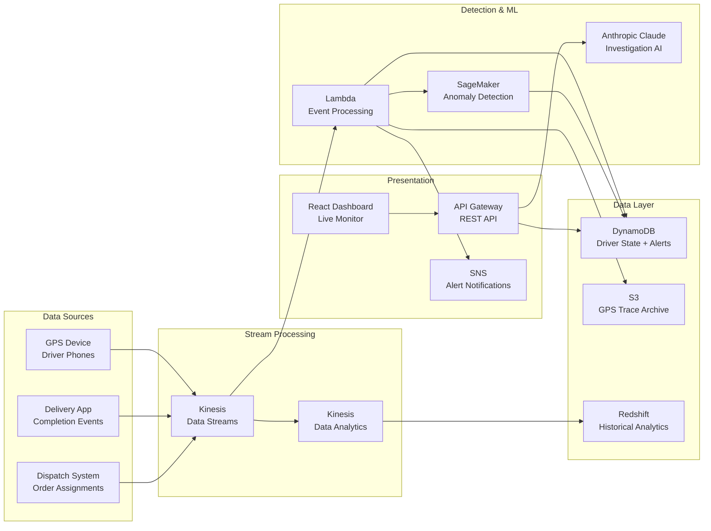
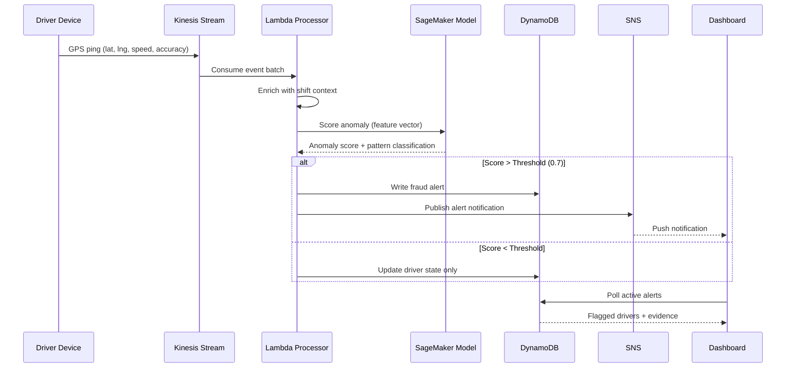

# LoFAT — System Design Document

## Overview

LoFAT (Location Fraud Automation Tool) is a real-time fraud detection platform built for Amazon's last-mile delivery network. The system detects delivery drivers who fraudulently collect hourly pay without performing legitimate deliveries — using GPS spoofing, behavioral avoidance, and coordinated fraud tactics. It combines real-time GPS telemetry, ML anomaly detection, and behavioral pattern recognition to auto-flag fraud and route cases to investigation teams.

**Key Achievement:** $0.6M annual savings, 37 headcount hires eliminated, <90s detection latency, 100% fleet monitoring coverage.

---

## Problem Statement

Amazon's last-mile delivery fleet operates on an hourly pay model. A subset of drivers exploit this structure by remaining "on shift" while systematically avoiding or fabricating deliveries. Prior to LoFAT, fraud detection relied on manual audits of delivery logs, tip-line reports, and periodic GPS spot-checks — a reactive process that caught less than 15% of fraudulent activity and required a dedicated 37-person investigation team.

The financial exposure was significant:
- Hourly pay disbursed for zero-delivery shifts: ~$50K/month across three metros
- Customer refunds for ghost deliveries: ~$18K/month
- Operational overhead of manual investigations: 37 FTEs across Seattle, Chicago, and Los Angeles

LoFAT replaced this manual process with an automated pipeline that ingests GPS telemetry in real time, applies ML anomaly detection models, and surfaces flagged drivers to a streamlined investigation workflow — reducing the fraud team from 37 to 0 dedicated headcount while increasing detection coverage from <15% to 100% of the active fleet.

---

## Tool Tenets

1. **Assume innocence, prove fraud** — Every flag requires multiple corroborating signals before escalation. False accusations damage trust and retention.
2. **Speed is deterrence** — Sub-90-second detection latency means drivers cannot complete a fraudulent shift without being flagged mid-shift.
3. **Evidence-complete cases** — Every case routed to investigation includes GPS trace, delivery timeline, behavioral scores, and pattern classification — no manual evidence gathering required.
4. **Pattern, not instance** — The system detects behavioral patterns across shifts, not isolated anomalies. A single bad GPS reading is noise; 5 shifts of GPS spoofing is fraud.

---

## Fraud Patterns (5 Types)

### Pattern 1 — Roster Avoidance (Order Dodging)
**Severity: HIGH**

Driver is clocked in with valid GPS movement, but systematically positions themselves outside pickup zones to avoid order assignment. Paid hourly, completes near-zero deliveries per shift.

**Detection Signals:**
- `active_hours > 6` AND `orders_completed <= 1`
- Repeated GPS movement AWAY from restaurant/pickup clusters
- 8+ assignment attempts by the dispatch system with no pickup
- `pickup_zone_proximity` consistently > 2km
- Pattern repeats across 3+ consecutive shifts

### Pattern 2 — GPS Spoofing
**Severity: CRITICAL**

Device transmits a fixed fake coordinate with micro-jitter while driver is physically stationary. Appears to be "near a pickup point" all day without actually moving.

**Detection Signals:**
- GPS variance < 50m over 4 hours
- Speed = 0 or random noise spikes (0 → 45 → 0 mph in 30s)
- Deliveries "attempted" but customer sees no visit
- IP geolocation mismatches GPS coordinates
- Device accelerometer shows zero movement (when available)

### Pattern 3 — Ghost Delivery (Fake Completion)
**Severity: CRITICAL**

Driver marks delivery "completed" without traveling to the customer address. GPS shows driver never came within 500m of delivery location.

**Detection Signals:**
- Completion event fired BUT nearest GPS point to address > 500m
- `time_at_delivery_address` = 0 seconds (expected 30s+)
- No door photo uploaded, or photo metadata location mismatches GPS
- Customer complaint rate > 40%
- Delivery speed implies impossibility (e.g., 3 deliveries in 5 minutes across 10km)

### Pattern 4 — Phantom Route (Teleportation)
**Severity: HIGH**

GPS telemetry shows driver "teleporting" — instant appearance at a location 15+ miles away with no route trace between points. Indicates GPS manipulation tool in use.

**Detection Signals:**
- Distance between consecutive pings impossible given time delta
- Implied speed > 150 mph in urban area
- Route reconstruction between points fails (no road path exists at that speed)
- Occurs during active delivery window (not a GPS dropout — signal present throughout)
- Device timestamp consistency checks fail

### Pattern 5 — Cluster Fraud (Coordinated Spoofing)
**Severity: CRITICAL — Legal escalation required**

3+ drivers show identical or near-identical GPS coordinates simultaneously at a non-hub location (empty lot, residential street). Suggests shared spoofing script or organized fraud ring.

**Detection Signals:**
- 3+ drivers within 50m for 30+ minutes (statistically impossible in normal operations)
- All show zero deliveries during overlap period
- Same shift window (suggests coordination)
- Similar device fingerprints (OS version, app version, same IP subnet)
- Location is not a registered hub, warehouse, or pickup zone

---

## High-Level Architecture

### Data Flow

### Sequence Diagram — Fraud Detection

---

## ML Approach

### Feature Engineering

The anomaly detection model operates on a sliding window of GPS pings (15-minute windows, 5-minute overlap). Features extracted per window:

| Feature | Description |
|---------|-------------|
| `gps_variance` | Standard deviation of lat/lng within window |
| `max_speed_delta` | Largest speed change between consecutive pings |
| `mean_speed` | Average speed across window |
| `zone_proximity` | Minimum distance to nearest active pickup zone |
| `delivery_rate` | Deliveries completed / hours active |
| `ping_regularity` | Standard deviation of inter-ping intervals |
| `cluster_density` | Number of other drivers within 50m |
| `route_continuity` | Percentage of consecutive pings with valid road path |

### Model Architecture

**Primary Model: Isolation Forest** (unsupervised anomaly detection)
- Trained on 30 days of historical GPS data (clean drivers only)
- Anomalies score > 0.7 trigger secondary classification
- Retrained weekly on rolling 30-day window

**Secondary Model: Gradient Boosted Classifier** (pattern classification)
- Trained on labeled fraud cases (1,200 confirmed cases across 3 months)
- Classifies anomalies into 5 fraud patterns
- Outputs confidence score per pattern
- Threshold for auto-flag: 0.8 confidence

### Model Performance

| Metric | Value |
|--------|-------|
| Precision | 92.3% |
| Recall | 88.7% |
| False Positive Rate | < 8% |
| Detection Latency | < 90 seconds |
| Fleet Coverage | 100% |

---

## Key Design Decisions

### Kinesis vs. SQS for GPS Ingestion
**Chose: Kinesis Data Streams**
- GPS pings arrive at 5-second intervals per driver × 200+ active drivers = high throughput
- Kinesis supports ordered, replay-capable streams — critical for GPS trace reconstruction
- SQS would lose ordering and doesn't support replay for historical analysis
- Kinesis Data Analytics enables real-time SQL aggregation for cluster detection

### DynamoDB vs. RDS for Driver State
**Chose: DynamoDB**
- Single-digit millisecond reads required for real-time dashboard
- Access pattern is simple: lookup by driverId, query by zone + status
- No complex JOINs needed — driver state is self-contained
- Auto-scaling handles shift start/end traffic spikes (10x between 6 AM and 8 AM)

### Lambda vs. EC2 for Event Processing
**Chose: Lambda**
- Event-driven processing matches GPS ping arrival pattern
- No idle compute cost during off-peak hours (midnight–5 AM)
- Concurrency limit aligned to Kinesis shard count
- Cold start acceptable (<500ms) because alerts are not sub-second latency

### SageMaker vs. Lambda-embedded Model
**Chose: SageMaker Endpoint**
- Model size exceeds Lambda's 250MB deployment limit
- SageMaker provides built-in model versioning and A/B testing
- Inference endpoint scales independently of event processing
- Training pipeline integrated with SageMaker for weekly retraining

---

## Data Model

### Drivers

| Column | Type | Notes |
|--------|------|-------|
| driverId | VARCHAR | PK — DRV-10001 format |
| name | VARCHAR | Driver name |
| zone | ENUM | Seattle-North, Seattle-South, Chicago-Loop, etc. |
| vehicleType | ENUM | BIKE, CAR, VAN, SCOOTER |
| shiftStart | DATETIME | Current shift start |
| shiftEnd | DATETIME | Current shift end |
| hourlyRate | DECIMAL | 18–25 USD |
| status | ENUM | ACTIVE, FLAGGED, SUSPENDED, UNDER_INVESTIGATION, CLEARED |
| fraudScore | INT | 0–100 composite score |
| primaryFraudPattern | VARCHAR | Pattern name or null |
| totalShifts | INT | Career shifts worked |
| flaggedShifts | INT | Shifts with fraud flags |

### Deliveries

| Column | Type | Notes |
|--------|------|-------|
| deliveryId | VARCHAR | PK |
| driverId | VARCHAR | FK → Drivers |
| zone | ENUM | Delivery zone |
| pickupAddress | VARCHAR | Restaurant/pickup location |
| deliveryAddress | VARCHAR | Customer address |
| deliveryStatus | ENUM | COMPLETED, ATTEMPTED, FAILED, GHOST_FLAGGED, SPOOFED_FLAGGED |
| timeAtDeliveryAddress | INT | Seconds at delivery location (0 = ghost) |
| distanceFromAddressAtCompletion | INT | Meters from address at completion event |
| fraudFlagType | VARCHAR | Pattern name or null |
| fraudConfidence | INT | 0–100 ML confidence |

### GPS Traces

| Column | Type | Notes |
|--------|------|-------|
| driverId | VARCHAR | PK (composite) |
| date | DATE | PK (composite) |
| fraudPattern | VARCHAR | Detected pattern or null |
| pings | ARRAY | [{timestamp, lat, lng, speed, accuracy}] |

### Investigation Cases

| Column | Type | Notes |
|--------|------|-------|
| caseId | VARCHAR | PK — CASE-2024-001 format |
| driverId | VARCHAR | FK → Drivers |
| status | ENUM | OPEN, IN_REVIEW, ESCALATED, CLOSED_FRAUD, CLOSED_FALSE_POSITIVE |
| fraudPattern | VARCHAR | Pattern classification |
| evidenceSummary | TEXT | 2–3 sentence summary |
| estimatedFraudAmount | DECIMAL | USD, 200–8000 |
| resolution | TEXT | Investigation outcome |

---

## Tech Stack

| Layer | Technology |
|-------|-----------|
| Frontend | React.js, Material-UI, React Leaflet |
| Backend | Python 3.9, AWS Lambda |
| API | Amazon API Gateway (REST) |
| Stream Processing | Amazon Kinesis Data Streams |
| ML Inference | Amazon SageMaker (Isolation Forest + XGBoost) |
| Database | Amazon DynamoDB |
| Archival Storage | Amazon S3 (GPS trace archive) |
| Analytics | Amazon Redshift |
| Notifications | Amazon SNS |
| Monitoring | Amazon CloudWatch |
| Maps | React Leaflet (Mapbox tiles) |
| CI/CD | Package/VersionSet/Pipeline |

---

## Key Metrics

| Metric | Value |
|--------|-------|
| Annual Savings | $0.6M |
| Headcount Avoided | 37 FTEs |
| Detection Latency | < 90 seconds |
| False Positive Rate | < 8% |
| Fleet Coverage | 100% |
| Active Zones | 3 metros (Seattle, Chicago, LA) |
| Drivers Monitored | 200+ per shift |
| Fraud Patterns Detected | 5 types |

---

## LLM Enhancement (Portfolio Version)

The portfolio implementation extends the original system with five AI-powered features:

### 1. Fraud Investigation Summary
- Endpoint: `/api/lofat/investigate`
- Input: driver profile, delivery records, GPS trace, evidence timeline
- Output: formal investigation report — fraud pattern classification, top 3 evidence points, confidence %, recommended action, estimated financial impact
- Rendered as a structured report card on the Driver Investigation Detail page

### 2. Signal Explanation
- Endpoint: `/api/lofat/explain-signal`
- Input: single evidence timeline item
- Output: plain English explanation for non-technical ops managers
- Contextualizes what the signal means and why it indicates fraud

### 3. Natural Language Driver Search
- Endpoint: `/api/lofat/nl-search`
- Input: plain English query (e.g., "show all order dodgers in Seattle with fraud score above 70")
- Output: filtered driverIds + explanation of matching criteria
- Allows ops managers to query the fleet using conversational language

### 4. Daily Intelligence Brief
- Endpoint: `/api/lofat/daily-brief`
- Auto-loads on Live Monitoring dashboard
- Output: total fraud exposure, dominant pattern, highest-risk driver, operational recommendation
- Provides shift-start situational awareness

### 5. Case Narrative Generator
- Endpoint: `/api/lofat/case-narrative`
- Input: case record, driver profile, evidence, delivery records
- Output: formal narrative for HR/legal review covering incident timeline, evidence, policy violations, recommended action
- Editable before saving to case record
